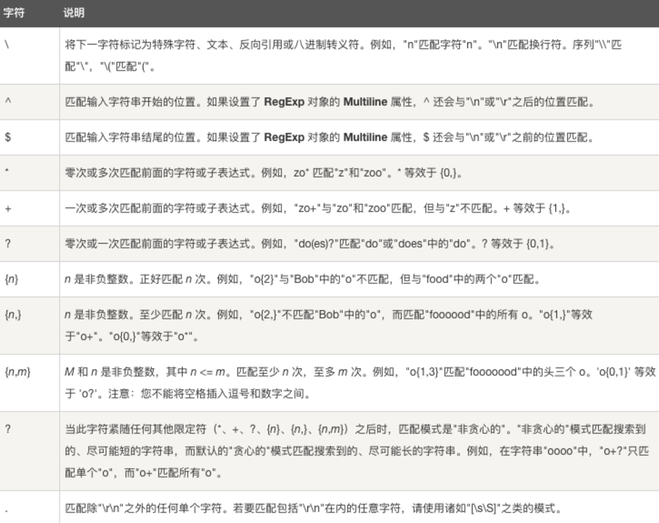
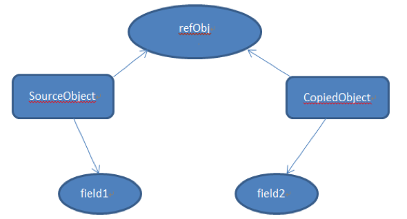
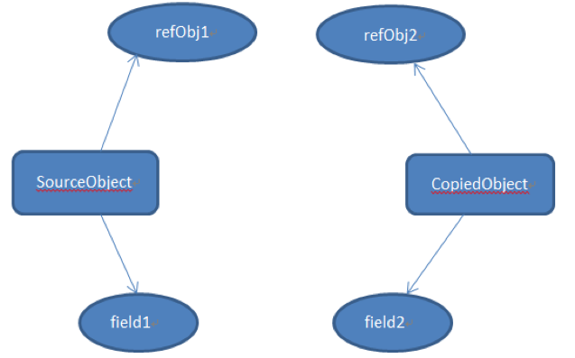

# <center>Advanced Java Knowledge</center>

## 1. List中的迭代器
```java
private class Itr implements Iterator<E> {
        int cursor = 0;
        int lastRet = -1;
        int expectedModCount = modCount;

        public boolean hasNext() {
            return cursor != size();
        }

        public E next() {
            checkForComodification();
            try {
                int i = cursor;
                E next = get(i);
                lastRet = i;
                cursor = i + 1;
                return next;
            } catch (IndexOutOfBoundsException e) {
                checkForComodification();
                throw new NoSuchElementException();
            }
        }

        public void remove() {
            if (lastRet < 0)
                throw new IllegalStateException();
            checkForComodification();

            try {
                AbstractList.this.remove(lastRet);
                if (lastRet < cursor)
                    cursor--;
                lastRet = -1;
                expectedModCount = modCount;
            } catch (IndexOutOfBoundsException e) {
                throw new ConcurrentModificationException();
            }
        }

        final void checkForComodification() {
            if (modCount != expectedModCount)
                throw new ConcurrentModificationException();
        }
}
```


## 2. super()与继承问题
```java
class Aa {
    public Aa(String a,String b) { 
    }
}
 
public class Bb extends Aa {
    public Bb(String a,String b) {
    //隐掉下面那句话后在此构造函数处提示：Implicit super constructor Aa() is undefined.
    //Must explicitly invoke another constructor
    //或者在父类显示写一个不带参数的构造函数
        super(a,b);
    } 
}
```

&#12288;&#12288;子类的构造方法如果没明确调用父类构造方法,会默认调用父类不带参数的构造方法。如果父类有定义带参数构造方法但没定义不带参数的构造方法,则不会默认创建不带参数的构造方法。这样子类调用就出错。


## 3. 反射缺点 
* 反射包括了一些动态类型，所以JVM无法对这些代码进行优化。因此，反射操作的效率要比那些非反射操作低得多。应避免在经常被 执行的代码或对性能要求很高的程序中使用反射。
* 安全限制(Security Restrictions): reflection requires a runtime permission which may not be present when running under a security manager. This is in an important consideration for code which has to run in a restricted security context, such as in an Applet. 


## 4. Comparable vs Comparator
### 4.1 Comparable 定义在 Person类的内部

`public class Persion implements Comparable {..比较Person的大小..}`,
`Collections.sort(personList)`可以得到正确的结果。


### 4.2 Comparator 定义在Person外部
&#12288;&#12288;此时`Person`类结构不需要有任何变化,如
`public class Person{ String name; int age }`

&#12288;&#12288;然后另外定义一个比较器:
`public PersonComparator implements Comparator() {..比较Person的大小..}`

&#12288;&#12288;当要对`personList`排序时, 除了要传递`personList`, 还要把`PersonComparator`传过去, 如:

`Collections.sort( personList , new PersonComparator() )`


### 4.3 Comparable example
```java
public class PersonComparable implements Comparable<PersonComparable>{
    private int age;
    private String name;
    
    public int compareTo(PersonComparable another) {
        if(another != null){
            return age - another.getAge();
        }else{
            throw new NullPointerException();
        }
   }
}

public static void main(String[] args) {
        PersonComparable[] pArr = new PersonComparable[2];
        pArr[0] = new PersonComparable("test1", 26);
        pArr[1] = new PersonComparable("test2", 19);
        
        Arrays.sort(pArr);
}
```

### 4.4 Comparator example
```java
public class PersonComparator implements Comparator<Person>{
    public int compare(Person p1, Person p2){
        if(p1 != null && p2 != null){
            return p1.getAge() - p2.getAge();
        }else{
            throw new NullPointerException();
        }
    }
}

public static void main(String[] args) {
        Person[] pArr = new Person[2];
        pArr[0] = new Person("test1", 26);
        pArr[1] = new Person("test2", 19);
        Arrays.sort(pArr, new PersonComparator());
}
```


## 5. Go vs Java
### 5.1 并发
&#12288;&#12288;首先，go提供goroutine作为原生的并发机制。每个goroutine所需的内存很少，实际应用中可以启动大量的goroutine对并发连接进行响应。goroutine遇到IO阻塞，调度器会自动切换到另一个goroutine执行，保证CPU不会因为IO而发生等待。
&#12288;&#12288;同时，go为goroutine提供了独到的通信机制——channel。channel发生读写的时候，会挂起当前操作channel的goroutine，是一种同步阻塞通信。这样既达到了通信的目的，又实现同步。
&#12288;&#12288;进行网游开发的程序员，可以将游戏逻辑按照单线程阻塞式的写，不需要额外考虑线程调度的问题，以及线程间数据依赖的问题。因为，线程间的channel通信，已经表达了线程间的数据依赖关系了，而go的调度器会给予妥善的处理。

### 5.2 编译
&#12288;&#12288;google go编译器和标准库总共近70万行go和汇编代码（包括测试代码则是过100万行），编译一次，在普通机器上耗时不到2分钟。

### 5.3 缺陷
&#12288;&#12288;Go语言比较新，学习成本和用人成本高；强类型转换。

### 5.4 其它：
* Go提供了闭包和Map，都是Go内建数据结构。
* 包管理，用go get <github地址>就能安装一个包或者一个命令，自动下载所有依赖
* defer 是个很好的想法，try ... finally 的升级版，更加灵活，可以更容易的让资源的分配与释放代码放在一起。
* 云服务。在国内写了一个网络应用，上传到国内服务器上，这时，巴西想用一下这个网络应用，他需要通过网络把请求发到国内服务器，然后原路返回，延迟巨大而且缺乏稳定性。一种解决方案是，把go原代码直接上传，巴西想用，通过网络，将源代码下载到巴西那里的服务器节点，编译链接生成应用，相当于直接在他国内使用，网络环境好了很多。但是，国内的服务器是windows server2008 64bit，巴西用的是freebsd 32bit，没关系go跨平台。但是，要用这个软件算几个矩阵乘法的最优解1分钟之内就应该解决，不会要让我等2-3分钟的编译时间吧，不会的，下载加编译，一共5秒，你还没刷新，我就编好了。


## 6. Regular Expression



## 7. Shallow Copy vs Deep Copy
### 7.1 Shallow Copy



&#12288;&#12288;浅拷贝是按位拷贝对象，会创建一个新对象。如果原始对象属性是基本类型，拷贝的就是基本类型的值；如果原始对象属性是内存地址（引用类型），拷贝的就是内存地址 ，因此如果其中一个对象改变了这个地址，就会影响到另一个对象。
&#12288;&#12288;图中，`SourceObject`有一个int类型的属性 `field1`和一个引用类型属性`refObj`。对`SourceObject`浅拷贝时，创建了`CopiedObject`。由于`field1`是基本类型，所以将它的值拷贝给`field2`，但由于`refObj`是引用类型, 所以`CopiedObject`指向`refObj`相同的地址。因此对`SourceObject`中的`refObj`所做的任何改变都会影响到`CopiedObject`。


### 7.2 Example of Shallow Copy
```java
public class Subject {
    private String name; 

    public Subject(String s) { 
      name = s; 
   } 
}

public class Student implements Cloneable { 
   private Subject subj;  // 对象引用
   private String name; 

   public Student(String s, String sub) { 
      name = s; 
      subj = new Subject(sub); 
   } 

   // 重写clone()方法, 浅拷贝
   public Object clone() { 
      try { 
         return super.clone();  // 直接调用父类的clone()方法
      } catch (CloneNotSupportedException e) { 
         return null; 
      } 
   } 
}
```

### 7.3 Deep Copy
&#12288;&#12288;深拷贝会拷贝所有的属性,并拷贝属性指向的动态分配的内存。当对象和它所引用的对象一起拷贝时即发生深拷贝。深拷贝相比于浅拷贝速度较慢并且花销较大。




### 7.4 Example of Deep Copy
```java
public class Student implements Cloneable { 
   private Subject subj;  // 对象引用 
   private String name; 

   public Student(String s, String sub) { 
      name = s; 
      subj = new Subject(sub); 
   } 

   // 重写clone()方法 
   public Object clone() { 
      // 深拷贝，创建拷贝类的一个新对象，这样就和原始对象相互独立
      Student s = new Student(name, subj.getName()); 
      return s; 
   } 
}
```


### 7.5 通过序列化深拷贝
&#12288;&#12288;请注意，通过序列化进行深拷贝时，必须确保对象图中所有类都是可序列化的。
```java
public class ColoredCircle implements Serializable { 
   private int x; 
   private int y; 

   public ColoredCircle(int x, int y) { 
      this.x = x; 
      this.y = y; 
   } 
}

public class DeepCopy {
   public static void main(String[] args) throws IOException { 
      ObjectOutputStream oos = null; 
      ObjectInputStream ois = null; 

      try { 
         ColoredCircle c1 = new ColoredCircle(100, 100);  // 创建原始的可序列化对象 
         ColoredCircle c2 = null; 

         // 通过序列化实现深拷贝 
         ByteArrayOutputStream bos = new ByteArrayOutputStream(); 
         oos = new ObjectOutputStream(bos); 

         // 序列化以及传递这个对象 
         oos.writeObject(c1); 
         oos.flush(); 
         ByteArrayInputStream bin = new ByteArrayInputStream(bos.toByteArray()); 
         ois = new ObjectInputStream(bin); 

         // 返回新的对象 
         c2 = (ColoredCircle) ois.readObject(); 
} catch (Exception e) { 
         System.out.println("Exception in main = " + e); 
      } finally { 
         oos.close(); 
         ois.close(); 
      } 
   } 
}
```


### 7.5 延迟拷贝
&#12288;&#12288;是浅拷贝和深拷贝的组合。当最开始拷贝一个对象时，会使用速度较快的浅拷贝，还会用计数器记录有多少对象共享这个数据。当程序想要修改原始的对象时，它会决定数据是否被共享（通过检查计数器）并根据需要进行深拷贝。 
&#12288;&#12288;延迟拷贝从外面看起来就是深拷贝，但是只要有可能它就会利用浅拷贝的速度。当原始对象中的引用不经常改变的时候可以使用延迟拷贝。由于存在计数器，效率下降很高，但只是常量级的开销。而且, 在某些情况下, 循环引用会导致一些问题。


## 8. StringBuilder, StringBuffer底层原理
&#12288;&#12288;都继承自AbstractStringBuilder这个类，底层都是char数组操作，StringBuffer之所以线程安全是所有方法都加了Synchronized


## 9. 求String输出结果
### 9.1 Case I
```java
public static void main(String[] args) {
    String str1 = "hello world";
    String str2 = new String("hellop world");
    String str3 = "hello world";
    String str4 = new String("hello world");

    System.out.println(str1 == str2);
    System.out.println(str1 == str3);
    System.out.println(str4 == str2);
}
```

Output:
> false, true, false

&#12288;&#12288;`str1`和`str3`都在编译期间生成了字面常量和符号引用，运行期间字面常量"hello world"被存储在运行时常量池。通过这种方式来将String对象跟引用绑定的话，JVM会先在运行时常量池查找是否存在相同的字面常量，如果存在，则直接将引用指向已经存在的字面常量；否则在运行时常量池开辟一个空间来存储该字面常量，并将引用指向该字面常量。

&#12288;&#12288;通过new关键字来生成对象是在堆进行的，而在堆对象生成的过程是不会去检测该对象是否已存在的。因此通过new来创建对象，创建出的一定是不同的对象，即使字符串的内容是相同的。


### 9.2 Case II
```java
String a = "hello2"; 　　
String b = "hello" + 2; 　　
System.out.println((a == b));
```

&#12288;&#12288;true。`b`在编译期间就已经被优化成"hello2"，因此在运行期间，变量`a`和变量`b`指向的是同一个对象。

### 9.3 Case III
```java
String a = "hello2"; 
String b = "hello";    
String c = b + 2;     
System.out.println((a == c));
```

&#12288;&#12288;false。由于有符号引用的存在，所以`c`不会在编译期间被优化，不会把`b + 2`当做字面常量来处理的，因此生成的对象是保存在堆上的。


### 9.4 Case IV
```java
String a = "hello2"; 
final String b = "hello"; 
String c = b + 2; 
System.out.println((a == c));
```

&#12288;&#12288;true。被`final`修饰的变量，会在class文件常量池中保存一个副本，不会通过连接而进行访问。对`final`变量的访问在编译期间都会直接被替代为真实的值。那么`String c = b + 2`在编译期间就会被优化成`String c = "hello" + 2`。


### 9.5 Case V
```java
 String a = "hello2"; 
 final String b = getHello(); 
 String c = b + 2;   
 System.out.println((a == c));
 ```
&#12288;&#12288;false。虽然`b`用`final`修饰，但由于其赋值是通过方法调用返回的，那么它的值只能在运行期间确定，因此`a`和`c`指向的不是同一个对象。


