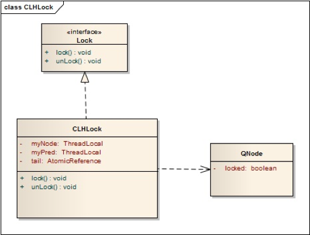

# CLH(Craig, Landin, and Hagersten)队列


 

* implements `Lock`
* 尾指针为`AtomicReference`类型，调用`getAndSet()`保证原子更新对象引用
* CLH Lock是一个自旋锁，可保证无饥饿以及公平
* 锁本身为`QNode`虚拟链表。
    * 共享的`tail`保存申请的最后的一个申请lock的线程的`myNode`域。
    * 每个申请`lock`的线程通过一个本地线程变量(ThreadLocal)`pred`指向前驱。另外一个本地线程变量`myNode`的`locked`保存本身的状态，`true`表示正在申请锁或已申请到锁；`false`已释放锁。
    * 每个线程通过监视自身的前驱状态，自旋等待锁被释放。释放锁时，把自身`myNode`的`locked`设为`false`，使后继线程获的锁，并回收前驱的`QNode`。
* 举例：线程A需要获取锁，其`myNode`域为`true`，`tail`指向线程A的结点，然后线程B也加入到线程A后面，`tail`指向线程B的结点。然后线程A和B都在它的`myPred`域上旋转，直到`myPred`结点的`locked`字段变为`false`，它就可以获取锁扫行。然后，线程A的`myPred`的`locked`域为`false`，此时线程A获取到了锁。

```java
public class CLHLock implements Lock {  
    AtomicReference<QNode> tail = new AtomicReference<QNode>(new QNode());  
    ThreadLocal<QNode> myPred;  
    ThreadLocal<QNode> myNode;  
  
    public CLHLock() {  
        tail = new AtomicReference<QNode>(new QNode());  
        myNode = new ThreadLocal<QNode>() {  
            protected QNode initialValue() {  
                return new QNode();  
            }  
        };  
        myPred = new ThreadLocal<QNode>() {  
            protected QNode initialValue() {  
                return null;  
            }  
        };  
    }  
  
    @Override  
    public void lock() {  
        QNode qnode = myNode.get();  
        qnode.locked = true;  
        QNode pred = tail.getAndSet(qnode);  
        myPred.set(pred);  
        while (pred.locked) {  
        }  
    }  
  
    @Override  
    public void unlock() {  
        QNode qnode = myNode.get();  
        qnode.locked = false;  
        myNode.set(myPred.get());  
    }  
} 
```