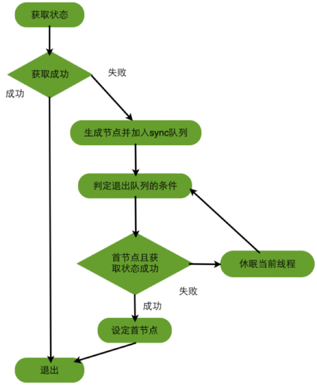

# <center>AQS(AbstractQueuedSynchronizer)</center>

<br></br>


## Introduction
----
提供了基于FIFO队列，可用于构建锁或者其他同步装置的基础框架。该同步器用一个`int`表示状态。使用的方法是子类通过继承同步器并实现它的方法来管理其状态。管理方式是通过`acquire`和`release`的方式来操纵状态。多线程中对状态操纵须确保原子性，因此子类需使用这个同步器三个方法对状态进行操作：
* `java.util.concurrent.locks.AbstractQueuedSynchronizer.getState()`
* `java.util.concurrent.locks.AbstractQueuedSynchronizer.setState(int)`
* `java.util.concurrent.locks.AbstractQueuedSynchronizer.compareAndSetState(int, int)`

同步器是实现锁的关键，利用同步器将锁的语义实现，然后在锁的实现中聚合同步器。可以这样理解：
* 锁的API是面向使用者的，定义了与锁交互的公共行为，而每个锁需完成特定的操作也是透过这些行为来完成的（比如：可以允许两个线程进行加锁，排除两个以上的线程），但是实现是依托给同步器来完成；
* 同步器面向的是线程访问和资源控制，定义了线程对资源是否能够获取以及线程排队等操作。

同步器的FIFO队列的Node保存线程引用和线程状态的容器，每个线程对同步器的访问，都是队列中的一个节点：

``` java
Node {
   int waitStatus;
   Node prev;
   Node next;
   Node nextWaiter;
   Thread thread;
}
```

`Node nextWaiter`存储condition队列中的后继节点。`int waitStatus`表示节点的状态，包含：
* CANCELLED，值为1，表示当前的线程被取消；
* SIGNAL，值为-1，表示当前节点的后继节点包含的线程需要运行，也就是unpark；
* CONDITION，值为-2，表示当前节点在等待condition，也就是在condition队列中；
* PROPAGATE，值为-3，表示当前场景下后续的acquireShared能够得以执行；
值为0，表示当前节点在sync队列中，等待着获取锁。

<br></br>


## Example
---
对于独占锁的获取和释放有以下伪码可以表示:

``` java
// 获取排他锁

while(获取锁) {

  if (获取到) {
      退出while循环
  } else {
      if(当前线程没有入队列) {
          那么入队列
      }
      阻塞当前线程
  }
}

// 释放排他锁

if (释放成功) {
    删除头结点
    激活原头结点的后继节点
}
```

排他锁的实现，一次只能一个线程获取到锁：

``` java
class Mutex implements Lock, java.io.Serializable {
    // 内部类，自定义同步器
    private static class Sync extends AbstractQueuedSynchronizer {
        // 是否处于占用状态
        protected boolean isHeldExclusively() {
            return getState() == 1;
        }

        // 当状态为0的时候获取锁
        public boolean tryAcquire(int acquires) {
            assert acquires == 1; // Otherwise unused
            if (compareAndSetState(0, 1)) {
                setExclusiveOwnerThread(Thread.currentThread());
                return true;
            }

            return false;
        }

        // 释放锁，将状态设置为0
        protected boolean tryRelease(int releases) {
            assert releases == 1; // Otherwise unused
            if (getState() == 0) 
                throw new IllegalMonitorStateException();

            setExclusiveOwnerThread(null);
            setState(0);

            return true;
        }

        // 返回一个Condition，每个condition都包含了一个condition队列
        Condition newCondition() { 
            return new ConditionObject(); 
        }
    }

    // 仅需要将操作代理到Sync上即可
    private final Sync sync = new Sync();

    public void lock()                { sync.acquire(1); }
    public boolean tryLock()          { return sync.tryAcquire(1); }
    public void unlock()              { sync.release(1); }
    public Condition newCondition()   { return sync.newCondition(); }
    public boolean isLocked()         { return sync.isHeldExclusively(); }
    public boolean hasQueuedThreads() { return sync.hasQueuedThreads(); }

    public void lockInterruptibly() throws InterruptedException {
        sync.acquireInterruptibly(1);
    }

    public boolean tryLock(long timeout, TimeUnit unit) throws InterruptedException {
        return sync.tryAcquireNanos(1, unit.toNanos(timeout));
    }
 }
```

<br></br>


## 基于FIFO的CLH变种队列，内部有个静态类Node
---
```java
    static final class Node {
        static final int CANCELLED =  1;
        static final int SIGNAL    = -1;
        static final int CONDITION = -2;
        static final int PROPAGATE = -3;
        volatile int waitStatus;
        volatile Node prev;
        volatile Node next;
        volatile Thread thread;
        Node nextWaiter;

        Node(Thread thread, Node mode) {     // Used by addWaiter
            this.nextWaiter = mode;
            this.thread = thread;
        }

        Node(Thread thread, int waitStatus) { // Used by Condition
            this.waitStatus = waitStatus;
            this.thread = thread;
        }
    }
```

其中借助了`volatile`，通过构造函数可以看出每个`Node`保存了Thread的信息。


AQS部分自己的成员也借助了`volatile`:

```java
private transient volatile Node head;
private transient volatile Node tail;
private volatile int state;
```

对于首尾结点（即获取释放锁和阻赛线程）和结点status设置都是类似CAS语义

<br></br>


## 尝试获取
----


```java
    public final void acquire(int arg) {
        if (!tryAcquire(arg) &&
            acquireQueued(addWaiter(Node.EXCLUSIVE), arg))
            selfInterrupt();
    }
```

上述逻辑主要包括：
1. 尝试获取（调用`tryAcquire`更改状态，需要保证原子性）: 在`tryAcquire`中利用`compareAndSet`保证只有一个线程能够对状态进行成功修改，而没有成功修改的线程将进入`sync`队列排队。
2. 如果获取不到，将当前线程构造成节点`Node`并加入`sync`队列；进入队列的每个线程都是一个节点`Node`，从而形成了一个类似CLH双向队列， 这样做的目的是线程间的通信会被限制在较小规模（也就是两个节点左右）。
3. 再次尝试获取，如果没有获取，那么将当前线程从线程调度器上摘下，进入等待状态。使用`LockSupport`将当前线程unpark。

<br>


### 如果尝试获取失败，添加进队列

```java
    private Node addWaiter(Node mode) {
        Node node = new Node(Thread.currentThread(), mode);
        // Try the fast path of enq; backup to full enq on failure
        Node pred = tail;
        if (pred != null) {
            node.prev = pred;
            if (compareAndSetTail(pred, node)) {
                pred.next = node;
                return node;
            }
        }
        enq(node);
        return node;
    }
    private Node enq(final Node node) {
        for (;;) {
            Node t = tail;
            if (t == null) { // Must initialize
                if (compareAndSetHead(new Node()))
                    tail = head;
            } else {
                node.prev = t;
                if (compareAndSetTail(t, node)) {
                    t.next = node;
                    return t;
                }
            }
        }
    }
```

上述逻辑主要包括：
1. 使用当前线程构造Node；将当节点前驱节点指向尾节点（`current.prev = tail`），尾节点指向它（`tail = current`），原有的尾节点的后继节点指向它（`t.next = current`）而这些操作要求是原子的。上面的操作是利用尾节点的设置来保证的，也就是`compareAndSetTail`来完成的。
2. 先行尝试在队尾添加`Node`；如果尾节点已经有了：
    1. 分配引用T指向尾节点；
    2. 将节点的前驱节点更新为尾节点（`current.prev = tail`）；
    3. 如果尾节点是T，将尾节点设置为该节点（`tail = current`，原子更新）；
    4. T的后继节点指向当前节点（`T.next = current`）。
3. 如果队尾添加失败或者是第一个入队的节点：如果是第1个节点，会进入到`enq`方法，进入的线程可能有多个，或者说在`addWaiter`中没有成功入队的线程都将进入`enq`方法。`enq`的逻辑是确保进入的`Node`都会有机会顺序的添加到`sync`队列中，而加入的步骤如下：
    1. 如果尾节点为空，那么原子化的分配一个头节点，并将尾节点指向头节点，这一步是初始化；
    2. 然后是重复在addWaiter中做的工作，但是在一个while(true)的循环中，直到当前节点入队为止。
  

进入`sync`队列之后，接下来就是要进行锁的获取，只有一个线程能够在同一时刻继续的运行，而其他的进入等待状态。而每个线程都是一个独立的个体，它们自省的观察，当条件满足的时候（自己的前驱是头结点并且原子性的获取了状态），那么这个线程能够继续运行。

<br>


### 再次尝试获取

```java
    final boolean acquireQueued(final Node node, int arg) {
        boolean failed = true;
        try {
            boolean interrupted = false;
            for (;;) {
                final Node p = node.predecessor();
                if (p == head && tryAcquire(arg)) {
                    setHead(node);
                    p.next = null; // help GC
                    failed = false;
                    return interrupted;
                }
                if (shouldParkAfterFailedAcquire(p, node) &&
                    parkAndCheckInterrupt())
                    interrupted = true;
            }
        } finally {
            if (failed)
                cancelAcquire(node);
        }
    }
```

上述逻辑主要包括：
1. 获取当前节点的前驱节点；需获取当前节点的前驱节点，而头结点所对应的含义是当前站有锁且正在运行。
2. 当前驱节点是头结点并且能够获取状态，代表该当前节点占有锁；如果满足上述条件，那么代表能够占有锁，根据节点对锁占有的含义，设置头结点为当前节点。
3. 否则进入等待状态。如果没有轮到当前节点运行，那么将当前线程从线程调度器上摘下，也就是进入等待状态。

<br>


### 尝试获取总结
1. 状态的维护；需要在锁定时，需要维护一个状态(int类型)，而对状态的操作是原子和非阻塞的，利用`compareAndSet`来确保原子性的修改。
2. 状态的获取；一旦成功的修改了状态，当前线程或者说节点，就被设置为头节点。
3. `sync`队列的维护。在获取资源未果的过程中条件不符合的情况下(不该自己，前驱节点不是头节点或者没有获取到资源)进入睡眠状态，停止线程调度器对当前节点线程的调度。这时引入的一个释放的问题，也就是说使睡眠中的`Node`或者说线程获得通知的关键，就是前驱节点的通知，而这一个过程就是释放，释放会通知它的后继节点从睡眠中返回准备运行。

<br></br>


## 释放结点
----
在`unlock`方法中使用了同步器`release`方法。release表示将状态设置回去，也就是将资源释放，将锁释放。
```java
    public final boolean release(int arg) {
        if (tryRelease(arg)) {
            Node h = head;
            if (h != null && h.waitStatus != 0)
                unparkSuccessor(h);
            return true;
        }
        return false;
    }
```

上述逻辑主要包括：
1. 尝试释放状态；`tryRelease`保证原子化的将状态设置回去，需使用`compareAndSet`保证。如果释放状态成功过之后，将会进入后继节点的唤醒过程。
2. 唤醒当前节点的后继节点所包含的线程。通过`LockSupport`的`unpark`方法将休眠中的线程唤醒，让其继续`acquire`状态。

```java
   private void unparkSuccessor(Node node) {
        /* 将状态设置为同步状态 */
        int ws = node.waitStatus;
        if (ws < 0)
            compareAndSetWaitStatus(node, ws, 0);

        /* 获取当前结点的后继结点，如果满足状态进行唤醒 
         * 如果没满足，则从尾部尾部开始寻找符合要求的结点进行唤醒
         */
        Node s = node.next;
        if (s == null || s.waitStatus > 0) {
            s = null;
            for (Node t = tail; t != null && t != node; t = t.prev)
                if (t.waitStatus <= 0)
                    s = t;
        }
        if (s != null)
            LockSupport.unpark(s.thread);
}
```

上述逻辑主要包括，该方法取出了当前节点的`next`引用，然后对其线程(Node)进行了唤醒，被唤醒的线程继续进行对资源的获取与争夺。

回顾整个资源的获取和释放过程：
* 获取时，维护了sync队列，每个节点都是一个线程在自旋，而依据是自己是否是首节点的后继且能够获取资源；
* 释放时，仅需将资源还回，然后通知后继节点并将其唤醒。
* 队列的维护（首节点的更换）是依靠消费者（获取时）来完成的。即满足了自旋退出条件时，这个节点就会被设置为首节点。

<br></br>


## 中断
----
该方法提供获取状态能力，在无法获取状态情况下会进入`sync`队列排队。这类似`acquire`，不同的地方在于它能够在外界对当前线程进行中断时提前结束获取状态的操作。就是在类似`synchronized`获取锁时，外界能够对当前线程进行中断，且获取锁的这个操作能够响应中断并提前返回。线程处于`synchronized`块中或者进行同步I/O时，对该线程进行中断操作，线程的中断标识位被设置为`true`，但线程继续运行。

如果在获取通过网络交互实现的锁时，锁资源进行了销毁。使用`acquireInterruptibly`的获取方式能让该时刻尝试获取锁的线程提前返回。

``` java
public final void acquireInterruptibly(int arg) throws InterruptedException {
  if (Thread.interrupted())
      throw new InterruptedException();

  if (!tryAcquire(arg))
      doAcquireInterruptibly(arg);
}

private void doAcquireInterruptibly(int arg) throws InterruptedException {
  final Node node = addWaiter(Node.EXCLUSIVE);
  boolean failed = true;

  try {
      for (;;) {
          final Node p = node.predecessor();

          if (p == head &amp;&amp; tryAcquire(arg)) {
              setHead(node);
              p.next = null; // help GC
              failed = false;
              return;
          }

          // 检测中断标志位
          if (shouldParkAfterFailedAcquire(p, node) && parkAndCheckInterrupt())
              throw new InterruptedException();
      }
  } finally {
      if (failed)
          cancelAcquire(node);
  }
}
```

上述逻辑主要包括：
1. 检测当前线程是否被中断，如果已被中断，抛出异常并将中断标志位设为`false`。
2. 调用`tryAcquire`尝试获取状态，如果顺利会获取成功并返回。
3. 构造节点并加入`sync`队列。获取状态失败后，将当前线程引用构造为节点并加入队列。退出队列方式在没有中断下和`acquireQueued`类似，当头结点是自己前驱节点且能够获取到状态时，即可以运行。
4. 中断检测。每次被唤醒时，中断检测，如果发现当前线程被中断，抛出`InterruptedException`并退出循环。

<br></br>


## 获取状态超时处理
----
该方法提供了超时获取状态的调用，如果`nanosTimeout`内没有获取到状态，返回`false`，反之返回`true`。可以看做`acquireInterruptibly()`升级版。针对超时控制，需计算出睡眠的delta，即间隔值。间隔可以表示为`nanosTimeout` = 原有`nanosTimeout` – now（当前时间）+ lastTime（睡眠之前记录的时间）。如果`nanosTimeout`大于0，那么还需要使当前线程睡眠，反之则返回false。

``` java
private boolean doAcquireNanos(int arg, long nanosTimeout) throws InterruptedException {

 long lastTime = System.nanoTime();
 final Node node = addWaiter(Node.EXCLUSIVE);
 boolean failed = true;

 try {
     for (;;) {
         final Node p = node.predecessor();

         if (p == head &amp;&amp; tryAcquire(arg)) {
             setHead(node);
             p.next = null; // help GC
             failed = false;

             return true;
         }

         if (nanosTimeout &lt;= 0)               
             return false;           
         if (shouldParkAfterFailedAcquire(p, node) && nanosTimeout > spinForTimeoutThreshold)
             LockSupport.parkNanos(this, nanosTimeout);

         long now = System.nanoTime();
         //计算时间，当前时间减去睡眠之前的时间得到睡眠的时间，然后被
         //原有超时时间减去，得到了还应该睡眠的时间
         nanosTimeout -= now - lastTime;
         lastTime = now;

         if (Thread.interrupted())
             throw new InterruptedException();
     }
 } finally {
     if (failed)
         cancelAcquire(node);
 }
}
```

上述逻辑主要包括：
1. 将当前线程构造成为节点`Node`加入到`sync`队列。
2. 条件满足直接返回；退出条件判断，如果前驱节点是头结点且成功获取到状态，那么设自己为头结点并退出，即在指定的`nanosTimeout`之前获取了锁。
3. 获取状态失败休眠一段时间；通过`LockSupport.unpark`指定当前线程休眠一段时间。
4. 计算再次休眠的时间；该时间为`nanosTimeout` = 原有`nanosTimeout` – `now`（当前时间）+ `lastTime`（睡眠之前记录的时间）。其中`now` – `lastTime`表示这次睡眠所持续的时间。
5. 休眠时间的判定。唤醒后的线程，计算仍需要休眠的时间，并无阻塞的尝试再获取状态，如果失败后查看`nanosTimeout`是否大于0，如果小于0，那么完全超时，没有获取到锁。 如果小于等于1000纳秒，则进入自旋过程。那么自旋会造成处理器资源紧张吗？经过测算，开销微乎其微。

上述过程可以如下图所示：

<p align="center">
  
</p>

