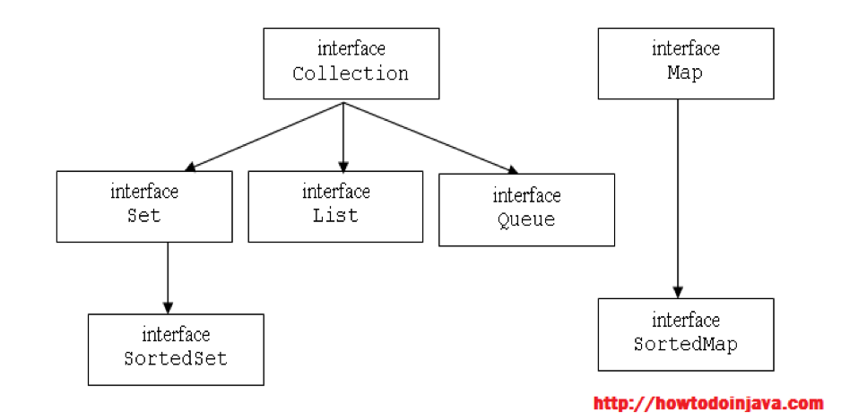

# <center>Java Data Structure</center>

<br></br>


> * Collections是个java.util下的类，它包含有各种有关集合操作的静态方法。
> * Collection是个java.util下的接口，它是各种集合结构的父接口。

<br></br>


## Priority Queue
----
* introduced in Java 1.5.
* it is an unbounded queue based on a priority heap.
* the elements are ordered by default in natural order or we can provide a Comparator for ordering at the time of instantiation of queue.
* doesn’t allow null values and we can’t create PriorityQueue of bbjects that are non-comparable.
* not thread safe or we can use PriorityBlockingQueue.
* _O(log(n))_ for enqueing and dequeing; _O(nlog(n))_ to go through the entire queue

```java
public class test {
    private String name;
    private int population;

    public test(String name, int population) {
        this.name = name;
        this.population = population;
    }

    public String toString(){
         return getName() + " - " + getPopulation();
    }

    public static void main(String args[]){
        Comparator<test> OrderIsdn =  new Comparator<test>(){
            public int compare(test o1, test o2) {
                int numbera = o1.getPopulation();
                int numberb = o2.getPopulation();
                if(numberb > numbera) {
                    return 1;
                }else if(numberb<numbera) {
                    return -1;
                }else{
                    return 0;
                }
            }   
        };
        Queue<test> priorityQueue =  new PriorityQueue<test>(11,OrderIsdn);

        test t1 = new test("t1",1);
        test t3 = new test("t3",3);
        test t2 = new test("t2",2);
        test t4 = new test("t4",0);
        priorityQueue.add(t1);
        priorityQueue.add(t3);
        priorityQueue.add(t2);
        priorityQueue.add(t4);
        System.out.println(priorityQueue.poll().toString());
    }
}
```

<br></br>


## Array vs ArrayList
----
1. Arrays can contain primitive or Objects whereas ArrayList can contain only objects. 
2. Arrays are fixed size whereas ArrayList size is dynamic. 
3. Arrays doesn’t provide a lot of features like ArrayList, such as `addAll()`, `removeAll()`, `iterator` etc.
4. For list of primitive data types, although Collections use autoboxing to reduce the coding effort but still it makes them slow when working on fixed size primitive data types. 

<br></br>


## Hash 
----
### Immutable Key
String, Integer and other wrapper classes are natural candidates of key, and String is most frequently used. Because String is immutable and final, and overrides `equals()` and `hashcode()` method. 

Immutabiility is required, in order to prevent changes on fields used to calculate `hashCode()` because if key object return different hashCode, then it won't be possible to get object from HashMap. 

Immutability is best as it offers other advantages as well like thread-safety. If you can keep your hashCode same by only making certain fields final, then you go for that as well.

<br>


### Override hashCode()
As much as is reasonably practical, the `hashCode()` method defined by class Object does return distinct integers for distinct objects. (This is typically implemented by converting the internal address of the object into an integer)

When an application is executed, the `hashcode()` returned for an object should be same till another execution of that application. Now coming to the important point which is the contract between `hashCode()` and `equals()` method, if two objects are equal, that is `obj1.equals(obj2)` is true then, `obj1.hashCode()` and `obj2.hashCode()` must return same integer

For Map key, following points should be considered:
1. If the class overrides `equals()`, it should also override `hashCode()`. 
2. If a class field is not used in `equals()`, you should not use it in `hashCode()`. 
3. Best practice for user defined key class is to make it immutable. 

<br>


### Performance
Hash tables suffer from _O(n)_ worst time complexity due to two reasons:
1. Too many elements were hashed into the same key.
2. Rehash.

The rehash operation, which is _O(n)_, can at most happen after $$ n/2 $$ ops. Thus when you sum the average time per op, you get : $$ (n * O(1) + O(n)) / n) = O(1) $$.

Another issue is due to cache performance. Hash Tables suffer from bad cache performance, and thus for large collection - the access time might take longer, since you need to reload the relevant part of the table from the memory back into the cache.

<br>


### Hash冲突
当关键字值不同的元素映象到哈希表同一地址上，即$$ k1 ≠ k2 $$，但$$ Hash(k1) = Hash(k2) $$，这种现象称为冲突。

哈希函数设计方法：
* 数字分析法 例如，有80个记录，关键字为8位十进制整数$$ d_1, d_2, d_3, …, d_8 $$，如哈希表长取_100_，则哈希表的地址空间为00~99。假设经过分析，各关键字中$$ d_{4} $$和$$ d_{7} $$取值分布较均匀，则哈希函数为_hash(key) = hash(d1d2d3…d7d8) = d4d7_。例如，h(81346532) = 43，h(81301367) = 06。

* 平方取中 先求关键字平方值，然后按需要取平方值的中间几位作为哈希地址。这是因为平方后中间几位和关键字中每一位都相关，故不同关键字会以较高的概率产生不同的哈希地址。

* 除留余数法 已知待散列元素为_(18，75，60，43，54，90，46)_，表长$$ m = 10 $$，$$ p = 7 $$，则有$$ h(18) = 18 % 7 = 4 $$, $$ h(75) = 75 % 7 = 5 $$。   

哈希冲突解决方法：
* 开放地址法
    * 线性探测再散列 顺序查看表中下一单元，直到找出一个空单元或查遍全表；
    * 二次探测再散列 冲突发生时，在表的左右进行跳跃式探测；
    * 伪随机探测再散列
* 再哈希
* 拉链法
* 公共溢出区：分为基本表和溢出表，和基本表发生冲突填入溢出表
* Rehash

<br></br> 


## ArrayList的fail-fast
----
如下的remove方法:
```java
public E remove(int index) {
          RangeCheck(index);
  
          modCount++; // 修改modCount
          E oldValue = (E) elementData[index];
  
          int numMoved = size - index - 1;
          if (numMoved > 0)
              System.arraycopy(elementData, index+1, elementData, index, numMoved);
          elementData[--size] = null; // Let gc do its work
  
          return oldValue;
}
```

以及ArrayList的Iterator（是在父类AbstractList实现）为例:
```java
public abstract class AbstractList<E> extends AbstractCollection<E> implements List<E> {
    // AbstractList中唯一的属性，用来记录List修改的次数
    protected transient int modCount = 0;

    // 返回List对应迭代器。实际上，是返回Itr对象。
    public Iterator<E> iterator() {
        return new Itr();
    }

    // Itr是Iterator(迭代器)的实现类
    private class Itr implements Iterator<E> {
        int cursor = 0;
        int lastRet = -1;

        // 每次遍历List中的元素，都会比较expectedModCount和modCount是否相等；
        // 若不相等，则抛出ConcurrentModificationException异常，产生fail-fast事件。
        int expectedModCount = modCount;

        public boolean hasNext() {
            return cursor != size();
        }

        public E next() {
            // 获取下一个元素之前，都会判断“新建Itr对象时保存的modCount”和“当前的modCount”是否相等；
            // 若不相等，则抛出ConcurrentModificationException异常，产生fail-fast事件。
            checkForComodification();
            try {
                E next = get(cursor);
                lastRet = cursor++;
                return next;
            } catch (IndexOutOfBoundsException e) {
                checkForComodification();
                throw new NoSuchElementException();
            }
        }

        public void remove() {
            if (lastRet == -1)
                throw new IllegalStateException();

            checkForComodification();

            try {
                AbstractList.this.remove(lastRet);
                if (lastRet < cursor)
                    cursor--;
                lastRet = -1;
                expectedModCount = modCount;
            } catch (IndexOutOfBoundsException e) {
                throw new ConcurrentModificationException();
            }
        }

        final void checkForComodification() {
            if (modCount != expectedModCount)
                throw new ConcurrentModificationException();
        }
    }
}
```

<br></br>


## Collection Hierarchy
----



<br></br>


## FAQ
----
* While passing a Collection as argument to a function, how can we make sure the function will not be able to modify it?

We can create a read-only collection using `Collections.unmodifiableCollection(Collection c)` method before passing it as argument, this will make sure that any operation to change the collection will throw UnsupportedOperationException.