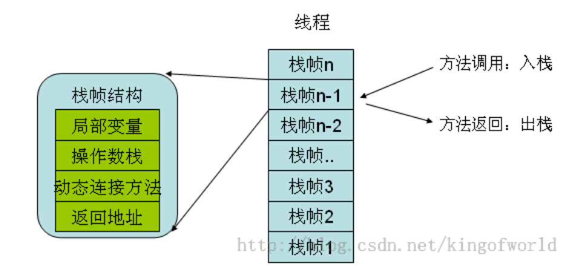

# 
Memory Model

  

  

  

## 程序计数器（Program Counter Register）
----
程序计数器是一块较小的内存空间，它是当前线程所执行的字节码的行号指示器。字节码解释器工作时通过改变这个计数器的值来选取下一条需要执行的字节码指令。分支、循环、跳转、异常处理、线程恢复等基础功能都需要依赖这个计数器来完成。

由于Java虚拟机的多线程是通过线程轮流切换并分配处理器执行时间的方式来实现的，在任何一个确定的时刻，一个处理器（对于多核处理器来说是一个内核）只会执行一条线程中的指令。因此，为了线程切换后能恢复到正确的执行位置，每条线程都需有一个独立的程序计数器，各条线程之间的计数器互不影响，独立存储，**称这类内存区域为线程私有的内存**。

如果线程正在执行的是一个Java方法，这个计数器记录的是正在执行的虚拟机字节码指令的地址；如果正在执行的是Natvie方法，这个计数器值则为Undefined。**此内存区域是唯一一个在Java虚拟机规范中没有规定任何OutOfMemoryError情况的区域。**

  

## Stack
----
### 虚拟机栈（Virtual Machine Stacks）

 

 

每个方法被执行的时候都会同时创建一个栈帧（Stack Frame）用于存储局部变量表、操作栈、动态链接、方法出口等信息。每一个方法被调用直至执行完成的过程，就对应着一个栈帧在虚拟机栈中从入栈到出栈的过程。

**与程序计数器一样，Java虚拟机栈也是线程私有的，它的生命周期与线程相同。**

存放了编译期可知的基本数据类型（boolean、byte、char、short、int, float、long、double）、对象引用（reference类型，指向对象起始地址的引用指针）和returnAddress类型（指向了一条字节码指令的地址）。

其中64位长度的long和double类型的数据会占用2个局部变量空间（Slot），其余的数据类型只占用1个。局部变量表所需的内存空间在编译期间完成分配。当进入一个方法时，这个方法需要在帧中分配多大的局部变量空间是完全确定的，在方法运行期间不会改变局部变量表的大小。

对这个区域规定了两种异常状况：StackOverflow和OutOfMemoryError。

A thread can only access its own thread stack. Local variables created by a thread are invisible to all other threads than the thread who created it, even if two threads are executing the exact same code.

 

### 本地方法栈（Native Method Stacks）
**本地方法栈与虚拟机栈所发挥的作用是非常相似的，其区别不过是虚拟机栈为虚拟机执行Java方法（也就是字节码）服务，而本地方法栈则为虚拟机使用到的Native方法服务。**

与虚拟机栈一样，本地方法栈区域也会抛出StackOverflowError和OutOfMemoryError异常。

  

## 堆
----
所有通过new创建的对象的内存都在堆中分配，其大小通过`-Xmx`和`-Xms`来控制。Java堆可以处于物理上不连续的内存空间中，只要逻辑上是连续的即可。既可以实现成固定大小的，也可以是可扩展的。 

  

## 方法区（Method Area）
----
**方法区与Java堆一样，是各个线程共享的内存区域，它用于存储已被虚拟机加载的类信息、常量、静态变量、即时编译器编译后的代码等数据。**JVM用持久代（Permanet Generation）存放方法区，可通过`-XX:PermSize`和`-XX:MaxPermSize`指定最小值和最大值。
         
这个区域的限制非常宽松，除了和Java堆一样不需要连续的内存和可以选择固定大小或者可扩展外，还可以选择不实现垃圾收集。这个区域的内存回收目标主要是针对常量池的回收和对类型的卸载。

 

### 运行时常量池（Runtime Constant Pool）
**运行时常量池是方法区的一部分。**Class文件中除了有类的版本、字段、方法、接口等描述等信息外，还有一项信息是常量池（Constant PoolTable），用于存放**编译期生成的各种字面量和符号引用，这部分内容将在类加载后存放到方法区的运行时常量池中**。

运行时常量池相对于Class文件常量池的另外一个重要特征是具备动态性，Java不要求常量只能在编译期产生，也就是并非预置入Class文件中常量池的内容才能进入方法区运行时常量池，运行期间也可能将新的常量放入池中，这种特性被利用得比较多的是String类的`intern()`。

