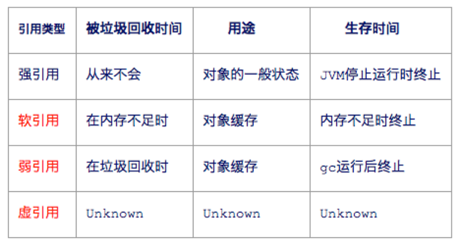

# <center>Reference</center>

<br></br>


## 4种引用
----


<br>


### StrongReference 强引用
强引用是指在程序代码之中普遍存在的，比如：

```java
Object obj = new Object();
String str = "hello";
```

只要某个对象有强引用与之关联，JVM必定不会回收这个对象，即使在内存不足的情况下，JVM宁愿抛出OOM也不会回收这种对象。如果想中断强引用和某个对象的关联，可以显示地将引用赋值为`null`， 比如Vector类的`clear()`方法：

```java
public synchronized E remove(int index) {
    modCount++;
    if (index >= elementCount)
        throw new ArrayIndexOutOfBoundsExpection(index);
    Object oldValue = elementData(index);
    int numMoved = elementCount - index - 1;
    if (numMoved > 0)
        System.arraycopy(elementData, index + 1, elementData, index, numMoved);
    elementData[--elementCount] = null; // let gc do its work

    return (E)oldValue;
}
```

<br>


### SoftReference 软引用
软引用是一些有用但不是必需的对象，用`java.lang.ref.SoftReference`类表示。软引用对象，只有内存不足时JVM才会回收，适合实现缓存。

软引用可和一个引用队列（ReferenceQueue）联合使用。如果软引用所引用的对象被JVM回收，这个软引用就会被加入到与之关联的引用队列中：

```java
import java.lang.ref.SoftReference;

public class Main {
    public static void main(String[] args) {
        SoftReference<String> ar = new SoftReference<String>(new String("hello"));
        System.out.println(sr.get());
    }
}
```

<br>


### WeakReference 弱引用
弱引用描述非必需对象。GC时，无论内存是否充足，都会回收弱引用对象。用`java.lang.ref.WeakReference`类表示：

```java
import java.lang.ref.WeakReference;

public class Main {
    public static void main(String[] args) {
        WeakReference<String> sr = new WeakReference<String>(new String("hello"));
        System.out.println(sr.get());
        System.gc(); 
        System.out.println(sr.get()); // null
    }
}
```

<br>


### PhantomReference 虚引用
虚引用不影响对象生命周期。用`java.lang.ref.PhantomReference`类表示。如果对象与虚引用关联，则跟没有引用与之关联一样，任何时候都可能被回收。

虚引用须和引用队列关联使用。当GC准备回收对象时，如果发现有虚引用，会把虚引用加入到与之关联的引用队列中。程序可通过判断引用队列中是否已经加入了虚引用，来了解被引用的对象是否将要被GC。如果程序发现虚引用已被加入到引用队列，就可在所引用对象内存被回收前采取行动。

```java
import java.lang.ref.PhantomReference;
import java.lang.ref.ReferenceQueue;

public class Main {
    public static void main(String[] args) {
        ReferenceQueue<String> queue = new ReferenceQueue<String>();
        PhantomReference<String> pr = new PhantomReference<String>(new String("hello"), queue);
        System.out.println(pr.get());
    }
}
```

<br></br>


## WeakHashMap
----
`java.util.WeakHashMap` uses weak references as the key. Therefore, when a particular key is not in use anymore, and it is garbage collected, the corresponding entry will disappear from the map. And the magic relies on ReferenceQueue mechanism to identify when a particular weak reference is to be garbage collected. This is useful when you want to build a cache based on weak references. 

<br></br>


## ReferenceQueue
----
当软可及对象被回收后，虽然这个SoftReference对象的`get()`方法返回`null`，但这个SoftReference对象已经不再具有存在的价值，需要一个适当的清除机制。`java.lang.ref`包提供ReferenceQueue。如果在创建SoftReference对象时，使用ReferenceQueue作为参数提供给SoftReference的构造方法，如:

```java
ReferenceQueue queue = new ReferenceQueue();
SoftReference ref = new SoftReference(aMyObject, queue);
```

当SoftReference引用的`aMyOhject`被回收时，`ref`所强引用的SoftReference对象被列入`ReferenceQueue`。 

任何时候都可调用ReferenceQueue的`poll()`方法检查是否有非强可及对象被回收。如果队列空，返回`null`，否则返回队列中前面的一个Reference对象。

<br></br>


## 解决OOM
----
GC线程对软可达对象和其他对象区别对待：软可及对象的清理由GC线程根据特定算法按照内存需求决定，即GC线程会在抛出OOM前回收软可及对象，且JVM会尽可能优先回收长时间闲置不用软可达对象，对刚构建或使用过的软可达对象会被JVM尽可能保留。在回收对象前，可通过`MyObject anotherRef =(MyObject) aSoftRef.get()`重新获得对该实例的强引用。而回收之后，调用`get()`方法只能得到`null`。
        
假如需读取大量本地图片，如果每次都从硬盘读取，会严重影响性能。如果全部加载到内存，又可能内存溢出。此时使用软引用可解决这个问题。比如用HashMap保存图片路径和相应图片对象关联的软引用之间的映射关系，内存不足时，JVM会回收缓存图片对象所占用的空间 。

```java
private Map<String, SoftReference<Bitmap>> imageCache = new HashMap<String, SoftReference<Bitmap>>();

public void addBitmapToCache(String path) {
    Bitmap bitmap = BitmapFactory.decodeFile(path); // StrongReference
    SoftReference<Bitmap> softBitmap = new SoftReference<Bitmap>(bitmap); // SoftReference
    imageCache.put(path, softBitmap); // cache it
}

public Bitmap getBitmapByPath(String path) {
    SoftReference<Bitmap> softBitmap = imageCache.get(path); // ger SoftReference object Bitmap from cache
    
    if (softBitmap == null)
        return null;

    Bitmap bitmap = softBitmap.get(); // get object Bitmap, if Bitmap is reclaimed, it will be null

    return bitmap;
}
```

<br></br>
